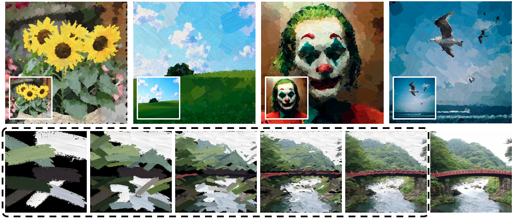
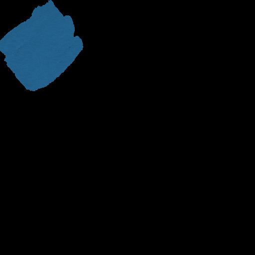
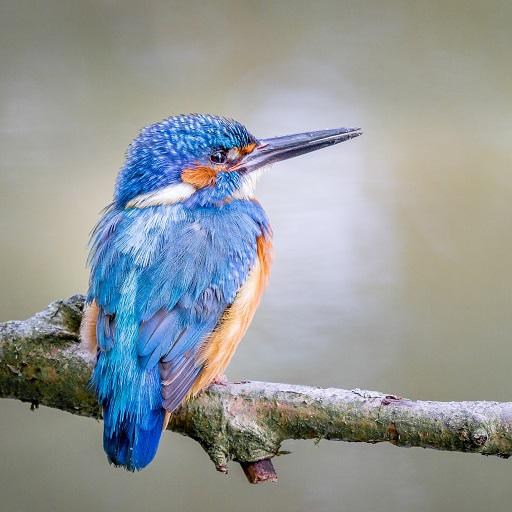
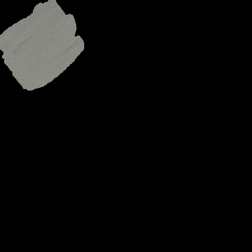
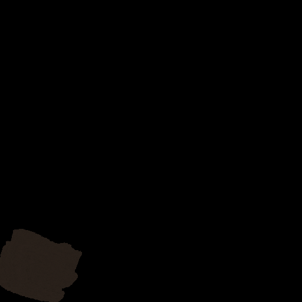

# Paint Transformer: Feed Forward Neural Painting with Stroke Prediction

> [[Paper](https://arxiv.org/abs/2108.03798)] [[Official Paddle Implementation](https://github.com/wzmsltw/PaintTransformer)] [[Huggingface Gradio Demo](https://huggingface.co/spaces/akhaliq/PaintTransformer)] [[Unofficial PyTorch Re-Implementation](https://github.com/Huage001/PaintTransformer)] [[Colab](https://colab.research.google.com/drive/1m2gAYOdRIQVxrnVySmA-Pug0H_I13-Sp?usp=sharing)]

## Overview

This repository contains the officially **unofficial** PyTorch **re**-implementation of paper:

*Paint Transformer: Feed Forward Neural Painting with Stroke Prediction*,

Songhua Liu\*, Tianwei Lin\*, Dongliang He, Fu Li, Ruifeng Deng, Xin Li, Errui Ding, Hao Wang (* indicates equal contribution)

ICCV 2021 (Oral)



## Prerequisites

* Linux or macOS
* Python 3
* PyTorch 1.7+ and other dependencies (torchvision, visdom, dominate, and other common python libs)

## Getting Started

* Clone this repository:

  ```shell
  git clone https://github.com/Huage001/PaintTransformer
  cd PaintTransformer
  ```

* Download pretrained model from [Google Drive](https://drive.google.com/file/d/1NDD54BLligyr8tzo8QGI5eihZisXK1nq/view?usp=sharing) and move it to inference directory:

  ```shell
  mv [Download Directory]/model.pth inference/
  cd inference
  ```

* Inference: 

  ```shell
  python inference.py
  ```

  * Input image path, output path, and etc can be set in the main function.
  * Notably, there is a flag *serial* as one parameter of the main function:
    * If *serial* is True, strokes would be rendered serially. The consumption of video memory will be low but it requires more time.
    * If *serial* is False, strokes would be rendered in parallel. The consumption of video memory will be high but it would be faster.
    * If animated results are required, *serial* must be True.

* Train:

  * Before training, start *visdom* server:

    ```shell
    python -m visdom.server
    ```

  * Then, simply run: 

    ```shell
    cd train
    bash train.sh
    ```

  * You can monitor training status at http://localhost:8097/ and models would be saved at checkpoints/painter folder.

* You may feel free to try other training options written in train.sh. 

## More Results

Input             |  Animated Output
:-------------------------:|:-------------------------:
  |  
  |  
  |  

## App

* Do not want to run the code? Try an App [_一刻相册_](https://photo.baidu.com/) downloaded from [here](https://photo.baidu.com/union/youa/home)!


## Citation

* If you find ideas or codes useful for your research, please cite:

  ```
  @inproceedings{liu2021paint,
    title={Paint Transformer: Feed Forward Neural Painting with Stroke Prediction},
    author={Liu, Songhua and Lin, Tianwei and He, Dongliang and Li, Fu and Deng, Ruifeng and Li, Xin and Ding, Errui and Wang, Hao},
    booktitle={Proceedings of the IEEE International Conference on Computer Vision},
    year={2021}
  }
  ```

## Acknowledgments

* This implementation is developed based on the code framework of **[pytorch-CycleGAN-and-pix2pix](https://github.com/junyanz/pytorch-CycleGAN-and-pix2pix)** by Junyan Zhu *et al.*
